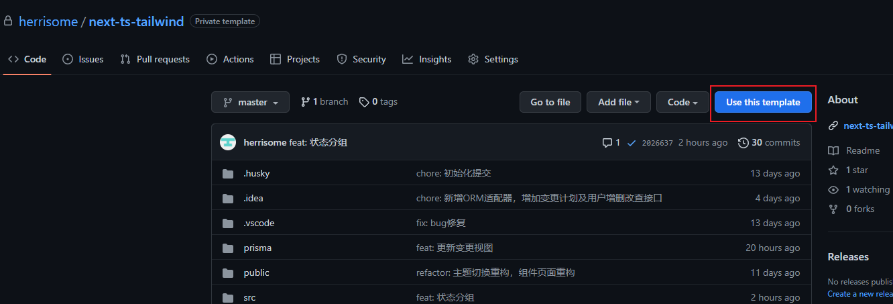

<!--suppress ALL -->
<div align="center">
  <h1>next-ts-tailwind</h1>
  <p>基于Next.js + Tailwind CSS + TypeScript + chakra UI</p>
</div>

## Getting Started

### 1. 使用`create-next-app`创建基础项目或直接在 github 上使用模板创建:

```bash
npx create-next-app -e https://github.com/herrisome/next-template.git project-name
```



### 2. 安装依赖

```bash
npm install
```

### 3. 运行开发服务器

使用以下命令启动服务器：

```bash
yarn dev
```

[打开浏览器](http://localhost:3000) 查看运行结果

### 4. 约定式提交

项目使用 [约定式提交](https://www.conventionalcommits.org/zh-hans/v1.0.0/), 提交时会根据规范进行校验
